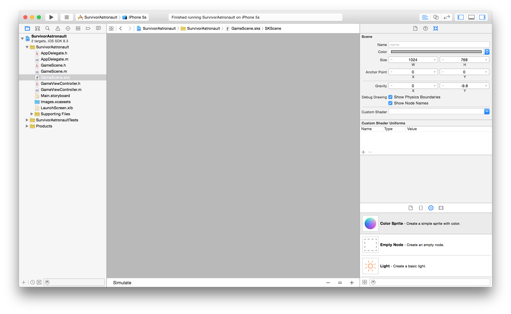

#SpriteKit

Vamos explorar alguns recursos do framework SpriteKit que é feito para desenvolvimento de jogos 2D no iOS.

Abra o Xcode e no File -> New -> Project escolha iOS Application e o template Game

Escolha o nome do projeto como SurvivorAstronaut, liguagem Objective-C, techonology Spritekit e Devices iPhone

Vamos fazer um jogo que só funcionará em modo portrait, portando desmarque Landscape Left e Landscape Right no target do projeto.

Será criada uma App com um StoryBoard e um GameViewController. O GameViewController aparentemente é um View Controller comum, com uma diferença sua view principal é do tipo SKView que é o equivalente ao UIView do spritekit

Se executarmos o projeto podemos verificar que no template existe uma implementação com um Label de Hello World, e se clicarmos em qualquer lugar é adicionado uma nave giratória no lugar que foi tocado.

Interessante notar a indicação abaixo na tela na qual o Spritekit informa o número de nós que atualmente estão na tela, além disso você tem uma constante visualização do frame rate, que em casos ideais deveria sempre estar em torno de 60 fps (frames for segundo). Importante é que o simulador não apresenta a mesma performance que um dispositivo, portanto se quiser acompanhar corretamente o frame rate você precisará desenvolver usando seu dispositivo iOS.

O SpriteKit trabalha com SKScene para representar as telas do seu jogo, de fato o XCode já criou uma SKScene para você chamada GameScene.h e GameScene.m, além disso temos uma novidade que é uma representação visual da tela no arquivo GameScene.sks que pode ser entendido como se fosse um arquivo de storyboard da sua Scene.

Aqui vamos fazer uma pequena modificação no GameViewController.m.
No método viewDidLoad temos o código que carrega nossa GameScene 

~~~objc
- (void)viewDidLoad
{
    [super viewDidLoad];

    // Configure the view.
    SKView * skView = (SKView *)self.view;
    skView.showsFPS = YES;
    skView.showsNodeCount = YES;
    /* Sprite Kit applies additional optimizations to improve 
      rendering performance */
    skView.ignoresSiblingOrder = YES;
    
    // Create and configure the scene.
    GameScene *scene = [GameScene unarchiveFromFile:@"GameScene"];
    scene.scaleMode = SKSceneScaleModeAspectFill;
    
    // Present the scene.
    [skView presentScene:scene];
}

~~~

Vamos criar o viewWillLayoutSubviews e migrar esse código para dentro dele, com um pequeno if para assegurar que esse código vai executar apenas após existir um skView. Esse movimento de código altera apenas a ordem de execução da Scene, mas nos poupa de alguns problemas que podem ocorrer.

~~~objc
- (void)viewDidLoad
{
    [super viewDidLoad];
    
}

-(void) viewWillLayoutSubviews
{
    [super viewWillLayoutSubviews];
    
    // Configure the view.
    SKView * skView = (SKView *)self.view;
    
    if (!skView.scene) {
        skView.showsFPS = YES;
        skView.showsNodeCount = YES;
        
        /* Sprite Kit applies additional optimizations to 
        improve rendering performance */
        skView.ignoresSiblingOrder = YES;
        
        // Create and configure the scene.
        GameScene *scene = [GameScene unarchiveFromFile:@"GameScene"];
        scene.scaleMode = SKSceneScaleModeAspectFill;
        
        // Present the scene.
        [skView presentScene:scene];
    }
    
}
~~~

A inclusão do if (!skView.scene) é necessário pois o viewWillLayoutSubviews pode executar antes da skView.scene existir.

Agora no nosso GameScene.m vamos apagar o código do Hello World. Seu resultado final deverá ser apenas os métodos vazios abaixo

~~~objc

-(void)didMoveToView:(SKView *)view {
    /* Setup your scene here */

}

-(void)update:(CFTimeInterval)currentTime {
    /* Called before each frame is rendered */
}
~~~

Agora que nos livramos do código do Hello world vamos começar a criar nosso jogo.

##O Jogo
Nosso jogo será de um astronauta que está na orbita da terra e de repente se inicia uma chuva de asteróides, que não causam mal algum e somem na atmosfera da terra, mas se acertarem nosso pequeno herói podem machucar muito.

Seu objetivo será fugir dos asteróides e sobreviver, usando os controlers de swipe horizontal para mover nosso herói.

##SKScene

Já temos criada nossa SKScene chamada GameScene, vamos clicar no GameScene.sks

Vamos alterar as propriedades

Name: world

Color: black

Size: W 640 H 1136

Anchor Point: 0.5 0.5

Aqui estamos colocando as dimensões iPhone5s Portrait apenas como referência visual, além disso setamos o anchor point para (0.5,0.5) para colocar a origem (0,0) no centro da tela, isso vai facilitar os cálculos para este jogo. 

Uma coisa importante é que na SKScene por padrão a origem (0,0) se encontra no canto inferior esquerdo, similar ao eixo cartesiano (X,Y) com Y crescendo para cima, assim Y aqui é invertido em relação a UIViews no UIKit.

Agora vamos copiar todos os arquivos de recursos que vamos usar no nosso jogo. No Finder abra na pasta Assets fornecida selecione todos os diretórios.

 
Arraste esses diretórios para dentro do projeto no XCode

Na janela que abre garanta que Copy items if needed esteja selecionado, a opção de Create Groups esteja ligada e o target principal do projeto também esteja selecionado.

Agora no XCode abra o folder Images e vamos migrar os 2 arquivos de imagem para dentro do Images.xcassets, para isso selecione o Images.xcassets e arraste os arquivos de imagem pixel_astronault.png e pixel_earth.png para dentro dele. Ah e apague o Spaceship que pertencia ao Hello World.

Com isso você pode apagar o folder Images com as duas imagens que estavam dentro dele com Delete -> Move to Trash

##Fonte
Voce incluiu uma fonte I-pixel-u.ttf e agora vamos configurar o Aplicativo para usá-la.
Dentro de Supporting Files -> selecione o arquivo Info.plist

E na "Information Property List" clique o + e adicione o novo valor
"Fonts provided by application" 

E adicione o valor I-pixel-u.ttf (o primeiro caracter é a vogal i maíuscula e não a consoante l) 

Ok, esta fonte é 100% free do http://www.dafont.com/i-pixel-u.font vamos instalar a fonte no nosso Mac para visualisar no XCode.
Para isso vá no Finder e selecione o arquivo I-pixel-u.ttf da fonte em Assests->Font 

Pressione a barra de espaço para ver o preview do arquivo
Clique no botão superior direito "Open with font Book"

Clique no botão "Install Font" 

Pode ser que o sistema reclame da fonte não oferecer todos os tipos, mas tudo bem, selecione a fonte e clique em "Install Checked".

Ok a fonte já está disponível no Mac e também já está configurada no nosso projeto.

## Adicionando Sprites
Vamos começar e editar nossa GameScene.sks adicionando Sprites.
Clique na nossa GameScene.sks e araste um Color Sprite para o centro dela.

Agora altere as propriedade desse novo sprite, ele será o nosso planeta:

Name: planet

Texture: pixel_earth.png

Size: W 100 H 100

Anchor Point: 0.5 0.5

Se você executar o projeto verá que agora o planeta já está sendo exibido na tela, note que a label de debug abaixo já mostra 1 node, indicando que existe um SKNode apenas nesta scene, bem como o frame rate que se mantém 60 frames por segundo.

Mais abaixo nas propriedades do planeta vamos adicionar um corpo físico para nosso planeta pois vamos usar isso para detectar colisões, porém não queremos que ele seja afetado pela gravidade.

Na sessão Phisics Definition altere as propriedades:

Body type: Bounding Circle

selecione Dynamic

desmarque Allows Rotation e Affected by Gravity

Os demais valores de Category e Collision vamos preencher via código, para ficar mais compreensível.

Bom, agora vamos adicionar nosso herói adicione outro ColorSprite do lado direito do planeta.
E altere as propriedades:

Name: astronaut

Parent: planet

Testure: pixel_astronault

Position: X 100  Y 0

Anchor Point: X 0.5  Y 0.5

Na sessão Phisics Definition do nosso astronaut altere as propriedades de maneira similar ao que fizemos para o planet:

Body type: Bounding Circle

selecione Dynamic

desmarque Allows Rotation e Affected by Gravity

Agora vamos adicionar um label no topo da tela

No SpriteKit o label é um SKLabel, vamos alterar o texto e a fonte do nosso label

Text: SCORE

Font: I pixel u (tamanho 32)
      

Copie e cole este label para criarmos mais um label do lado e altere as propriedades:

Name: scoreLabel

Horizontal Align: Left

Text: SCORE

Este label será a contagem de pontos do usuário, agora vamos adicionar as vidas do nosso astronaulta.

Arraste um ColorSprite abaixo do label score 

Texture : pixel_astronaut.png

Copie mais uma vez o label SCORE criando um label com texto "x"

Text: x

Por fim, mais uma vez o label SCORE criando um label com texto "5" que será o número de vidas

Name: livesLabel

Text: 5

Se executar você deveria ter um visual semelhante a este abaixo, veja que temos 7 nodes agora.

## Sistemas de Partículas

Nosso astronaulta está sozinho no espaço, mas um fundo inteiro preto não está parecendo muito o espaço de verdade, vamos adicionar umas estrelas para fazer ele mais real.

Jogos geralmente possuem sistemas de partículas ou SKEmitterNodes do spritekit. Sistemas de partículas são muito usados para quando temos elementos que as arestas são difíceis de modelar em um único objeto, por exemplo, fogo, fumaça, etc. 

Nós poderíamos simplesmente arrastar um Emitter e configurá-lo, mas vamos usar o editor visual que o Spritekit possui para isso.

No menu do XCode Clique em File -> New -> File... e crie um Spritekit Particle 

Escolha o template de Rain

Nomeie o arquivo de StarField.sks

Se você selecionar o arquivo verá um editor visual que já anima o sistema de partículas

Vamos alterar umas propriedades e fazer nosso sistema parecer com estrelas.

Lifetime: Start 1

Position Range: X 1000  Y 1000

Angle: Start 0  Range 0

Speed: Start 0  Range 0

Acceleration: X 0   Y 0

Scale: Start 0.1 Range 0.1 Speed -0.01

Color Ramp: com duas cores ClearColor (0% opacity) e White Color

Pronto agora nosso sistema de partículas parece um fundo de estrelas piscando. Sistemas de partículas são muito poderosos, investigue depois os outros templates.

Clique novamente na nossa GameScene.sks e vamos arrastar o sistema de partículas Starfield.sks para dentro dela alterando a posição para o centro

Position: X 0  Y 0

Perceba que foi criado um Emitter exatamente com os valores que configuramos, embora criar o arquivo StarField.sks não fosse necessário, é interessante usá-lo pois ele apresenta o resultado em tempo real do seu sistema de partículas conforme você edita os valores.

Execute novamente e veja que agora nosso astronauta parece estar mesmo no espaço.

Note que o numero de nodes aumentou drasticamente, isso ocorre porque sistemas de partículas geram um Node para cada partícula gerada. Por isso será bom sempre verificar o quanto eles podem afetar o frame rate

## Vídeo

Vídeos são muito comuns de serem usados em jogos, vamos imcrementar mais nosso background incluindo um vídeo em loop que vai ficar no fundo.

No arquivo GameScene.m abaixo do import "GameScene.h" adicione uma propriedade AVPlayer

~~~objc
@import AVFoundation;

@interface GameScene()

@property (nonatomic, strong) AVPlayer *bgVideoPlayer;

@end
~~~

Agora dentro do @implementation GameScene vamos criar um getter customizado para o bgVideoPlayer que vai criar uma instância de um AVPlayer apenas quando ela for necessária, e após criada será sempre usado a mesma instância. Isso é chamado Lazzy Instantiation e é muito comum de ser usada em games.

~~~objc
- (AVPlayer *)bgVideoPlayer
{
    if (!_bgVideoPlayer) {
        NSURL *url = [NSURL fileURLWithPath:
        [[NSBundle mainBundle] pathForResource:@"background" 
                                        ofType:@"mp4"]];
                                        
        _bgVideoPlayer = [[AVPlayer alloc] initWithURL:url];
        
        _bgVideoPlayer.actionAtItemEnd = AVPlayerActionAtItemEndNone;
        
        [[NSNotificationCenter defaultCenter] addObserver:self
                      selector:@selector(bgVideoDidEnd:)   
                          name:AVPlayerItemDidPlayToEndTimeNotification
                        object:[_bgVideoPlayer currentItem]];
    }
    
    return _bgVideoPlayer;
}
~~~

Além de criar a instância da propriedade bgVideoPlayer, nós registramos nossa classe para ser notificada quando o vídeo acabar, porém vemos um warning que o @selector(bgVideoDidEnd:) não existe ainda, vamos criá-lo 

~~~objc
- (void)bgVideoDidEnd:(NSNotification *)notification {
    AVPlayerItem *p = [notification object];
    [p seekToTime:kCMTimeZero];
}
~~~

o método bgVideoDidEnd será disparado quando o vídeo terminar, neste momento a única coisa que fazemos é voltar para o time zero, possibilitando o player continuar tocando o vídeo do início novamente.

Vamos agora criar o SKVideoNode e adicioná-lo dinamicamente na nossa Game Scene.
Crie o método initWithCoder que será disparado automaticamente quando o ViewController carregar nosso arquivo GameScene.sks

~~~objc
-(id) initWithCoder:(NSCoder *)aDecoder
{
    self = [super initWithCoder:aDecoder];
    
    if(self)
    {
        //VIDEO BACKGROUND
        SKVideoNode *videoNode = [[SKVideoNode alloc]
                                           initWithAVPlayer:self.bgVideoPlayer];
        videoNode.size = self.size;
        videoNode.zPosition = -1;
        videoNode.alpha = 0.4;
        [self addChild:videoNode];
        [videoNode play];
    }

    return self;
}
~~~

Execute e verifique que agora temos um vídeo em loop tocando no fundo da nossa game scene. Note que o frame rate no simulador caiu bastante, só que se você executar no dispositivo verá que teremos ainda 60fps, assim como dito anteriormente para acompanhar o frame rate real é necessário executar no dispositivo.

## Pontuação e Vidas

Nós já temos labels para apresentar a pontuação e as vidas do nosso herói, agora vamos adicionar propriedades no GameScene.m para controlar os valores que serão exibidos.

Abaixo da propriedade bgVideoPlayer adicione as propriedades

~~~objc
@property (nonatomic) unsigned long score;
@property (nonatomic) unsigned long lives;
@property (nonatomic,strong) SKLabelNode *scoreLabel;
@property (nonatomic,strong) SKLabelNode *livesLabel;
@property (nonatomic,strong) SKNode* planetNode;
@property (nonatomic,strong) SKNode* astronautNode;
~~~

Agora no initWithCoder abaixo da linha [videoNode play] adicione a inicialização dos nodes

~~~objc
self.scoreLabel = (SKLabelNode*) [self childNodeWithName:@"scoreLabel"];
self.livesLabel = (SKLabelNode*) [self childNodeWithName:@"livesLabel"];
self.planetNode = [self childNodeWithName:@"planet"];
self.astronautNode = [self.planetNode childNodeWithName:@"astronaut"];
        
[self setup];
~~~

Os Nodes não estão sendo instanciados com alloc e init, ao invés disso como já existem dentro do nosso GameScene.sks estamos recuperando suas instâncias chamando childNodeWithName.

O método setup ainda não existe, nele vamos inicializar nosso game, vamos criá-lo
para inicializar os valores, preencher os labels.

~~~objc
- (void)setup
{
    self.anchorPoint = CGPointMake(0.5, 0.5);
    self.score = 0;
    self.scoreLabel.text = [NSString stringWithFormat:@"%lu",self.score ];
    self.lives = 5;
    self.livesLabel.text = [NSString stringWithFormat:@"%lu",self.lives ];
}
~~~

Executando podemos verificar que os labels já estão sendo alterados para os valores iniciais de início do jogo

Vamos criar um método para nosso astronauta sofrer dano quando ele for atingido.

~~~objc
- (void)damageAstronaut
{   
    self.lives--;
    self.livesLabel.text = [NSString stringWithFormat:@"%lu",self.lives ];
    
    if(self.lives == 0)
    {
        // Game Over
        
    } else
    {
       // Animate damage

    }
}
~~~
Por enquando não tratamos o game over nem a animação de dano, faremos isso mais adiante. Agora também vamos criar um método para quando o astronaulta marcar mais pontos.

~~~objc
- (void)addScore
{
    self.score++;
    self.scoreLabel.text = [NSString stringWithFormat:@"%lu",self.score ];
}

~~~

## Inimigos
Por enquanto, a vida desse astronaulta está muito tranquila, vamos adicionar nossos inimigos para adicionar mais emoção no jogo.

Nosso inimigo será um cinturão de asteróides que será atraído pela gravidade da terra. Nosso platena está a salvo pois os asteróides desintegram na atmosfera, mas nosso herói precisará de toda sua habilidade para se esquivar deles.

Nosso inimigo será um SKShapeNode, e para manter o código que o manipula isolado do GameScene vamos criar uma nova classe que extende o SKShapeNode.

Vá em File -> New -> File ... 

No iOS -> Source -> Cocoa Touch Class

Crie uma classe que extende SKShapeNode em Objective-C chamada AsteroidsBeltNode

No arquivo AsteroidsBeltNode.h crie a assinatura de duas funções, uma para inicializar e um update

AsteroidsBeltNode.h

~~~objc
-(id) initWithStartingRadius:(CGFloat) radius holeAngle:(CGFloat) holeAngle;

-(void) update;
~~~

No AsteroidsBeltNode.m abaixo do #import "AsteroidsBeltNode.h" vamos criar algumas propriedades

~~~objc
@interface AsteroidsBeltNode()

@property (nonatomic) CGAffineTransform rotation;
@property (nonatomic) CGFloat holeAngle;
@property (nonatomic) CGFloat currentRadius;

@end
~~~

Nosso cinturão de asteróides será um arco com uma abertura semelhante ao desenho da letra "C" para isso vamos definir o ângulo da abertura e o raio do arco, além disso vamos rotacionar a abertura para cada vez ela aparecer em um lugar diferente.

No AsteroidsBeltNode.m vamos implementar o initWithStartingRadius dentro do @implementation AsteroidsBeltNode

~~~objc
-(id) initWithStartingRadius:(CGFloat) radius holeAngle:(CGFloat) holeAngle
{
    self = [super init];
    
    if (self)
    {
        UIBezierPath *path = [UIBezierPath bezierPathWithArcCenter:CGPointZero
                                                            radius:radius
                                                        startAngle:0
                                                          endAngle:2*M_PI
                                                         clockwise:YES];
        self.currentRadius = radius;
        self.holeAngle = holeAngle;
        self.rotation = CGAffineTransformMakeRotation(arc4random());
        
        [path applyTransform:self.rotation];
        
        self.path = [path CGPath];
        
        self.fillColor = [SKColor clearColor];
        self.strokeColor = [SKColor colorWithRed:143/255.0 
                                           green:1.0 
                                           blue:1.0 
                                           alpha:1.0];
        
        SKShader* shader = [SKShader shaderWithFileNamed:@"enemyShader.fsh"];

        self.strokeShader = shader;
        
        self.antialiased = NO;
        self.lineWidth = 10;
        
    }
    
    return self;
}
~~~

Um SKShapeNode pode ser facilmente criado a partir de um UIBezierPath para isso apenas criamos um Arco como path. Depois definimos um ângulo aleatório para rotacionar esse arco.
A novidade aqui é que para a cor estamos usando um shader, enemyShader.fsh. Shaders são implementações do OpenGL ES (Embeded Systems) que rodam direto na GPU, e usam uma liguagem própria Shader Language, que é parecida com linguagem C.
Aqui não vamos abordar Shaders mas saiba que eles são um recurso muito poderoso para texturas dinâmicas por exemplo.

Agora nosso inimigo precisa simular que está sendo atraído gravitacionalmente para a tela, com isso vamos implementar seu método update que será responsável por ir decrementando o raio ao longo do tempo

~~~objc
-(void) update
{
    self.currentRadius *= 0.99;
    
    UIBezierPath *newPath = 
           [UIBezierPath bezierPathWithArcCenter:CGPointZero
                                          radius:self.currentRadius
                                          startAngle:0
                                          endAngle:2 * M_PI - self.holeAngle
                                          clockwise:YES];
    
    [newPath applyTransform:self.rotation];
    
    self.path = [newPath CGPath];   
}
~~~

No update reduzimos o raio para 99% do raio anterior e criamos um novo UIBezierPath com o novo raio atribuindo este novo path ao SKShapeNode

Já temos nossa classe que representa o inimigo, agora vamos cuidar de colocar inimigos na nossa game scene.

No nosso GameScene.m abaixo da propriedade astronautNode vamos criar um Array para conter todos os inimigos

~~~objc

@property (nonatomic,strong) NSMutableArray* enemies;

~~~

E novamente vamos criar um getter com lazy instantiation

~~~objc
-(NSMutableArray *) enemies
{
    if(!_enemies)
    {
        _enemies = [NSMutableArray array];
    }
    
    return _enemies;
}
~~~

Agora precisamos adicionar uma lógica para adicionar os inimigos na tela, faremos isso com o uso de NSTimer.

No GameScene.m fim do initWithCoder antes da linha [self setup] adicione o NSTimer

~~~objc
[NSTimer scheduledTimerWithTimeInterval:2.0 
                                 target:self 
                                 selector:@selector(addEnemy:) 
                                 userInfo:nil 
                                 repeats:YES];
~~~

Agora vamos criar o método addEnemy que está faltando sem esquecer de importar o AsteroidsBeltNode.h

~~~objc
#import "AsteroidsBeltNode.h"
~~~

~~~objc
-(void) addEnemy: (NSTimer*) timer
{    
    AsteroidsBeltNode *newEnemy = 
    [[AsteroidsBeltNode alloc] initWithStartingRadius:self.size.width 
                                            holeAngle:M_PI_2];
    
    [self.enemies addObject:newEnemy];
    
    [self addChild:newEnemy];

}
~~~

Agora os inimigos já estão sendo adicionados porém precisamos para cada um chamar o método update de cada inimigo para eles simularem a atração gravitacional.

Para toda Game Scene o Spritekit chama o método (void)update:(CFTimeInterval)currentTime uma vez apra cada frame, vamos aproveitar esse método para chamar os métodos update de todos os objetos dos inimigos

~~~objc
-(void)update:(CFTimeInterval)currentTime {
    /* Called before each frame is rendered */
    
    [self.enemies makeObjectsPerformSelector:@selector(update)];
}
~~~

Se executarmos agora podemos ver nossos asteroides aparecendo.

O problema agora é que se os inimigos atingirem nosso herói nada acontece, na próxima sessão vamos resolver esse problema.

## Colisão
É muito comum em jogos a necessidade de detectar quando dois objetos colidem ou entram em contato.

Para nosso jogo precisamos detectar quando os inimigos colidem com o herói para aplicar o dano no herói e quando os inimigos colidem com o planeta para contabilizar um ponto para o nosso game.

No SpriteKit a colisão é aplicável com a física, sendo que pode também ser detectado o contato, por exemplo quando dois objetos entram em contato, ou se sobrepõem ou por fim perdem o contato entre si.

Basicamente o que vamos definir são mascaras de bits como se fossem uma categoria, no nosso caso 1 bit para o planeta, 1 bit para o astronauta e 1 bit para os inimigos. 

No arquivo  GameScene.h vamos incluir o protocolo de SKPhysicsContactDelegate

~~~objc
@interface GameScene : SKScene<SKPhysicsContactDelegate>
~~~

No arquivo GameScene.m logo abaixo do @implementation GameScene vamos criar umas variáveis estáticas com as 3 categorias que vamos usar no nosso jogo.

~~~objc
static const uint32_t astronautCategory = 0x1 << 0; // 1
static const uint32_t enemyCategory   = 0x1 << 1; // 2
static const uint32_t planetCategory   = 0x1 << 2; // 4
~~~

Agora vamos programar as categorias de cada objeto dentro do initWithCoder abaixo da linha

self.astronautNode = [self.planetNode childNodeWithName:@"astronault"];

vamos incluir as categorias

~~~objc
self.planetNode.physicsBody.categoryBitMask = planetCategory;
self.planetNode.physicsBody.contactTestBitMask = enemyCategory;
self.planetNode.physicsBody.collisionBitMask = 0;
        
self.astronautNode.physicsBody.categoryBitMask = astronautCategory;
self.astronautNode.physicsBody.contactTestBitMask = enemyCategory;
self.astronautNode.physicsBody.collisionBitMask = 0;

self.physicsWorld.contactDelegate = self;
~~~

Aqui nós estamos configuranto que o planeta é da categoria planetCategory e vamos testar seu contato com um enemyCategory, o collision é colocado em zero propositalmente pois não queremos simular a fisica dos objetos colidindo.

Já o astronauta também está configurado para colidir com o inimigo.

Vamos agora configurar o Inimigo, vá até o método addEnemy e abaixo da variável AsteroidsBeltNode *newEnemy adicione o código

~~~objc
newEnemy.physicsBody = [SKPhysicsBody  
                                      bodyWithEdgeChainFromPath:newEnemy.path];
newEnemy.physicsBody.categoryBitMask = enemyCategory;
newEnemy.physicsBody.contactTestBitMask = astronautCategory | planetCategory;
newEnemy.physicsBody.collisionBitMask = 0;
~~~

Aqui estamos falando que nosso inimigo pode entrar em contato tanto com astronauta quanto com o planeta.

Agora precisamos de uma atualização no AsteroidsBeltNode.m dentro do método update adicione no fim do método apos a linha self.path = [newPath CGPath]

~~~objc
uint32_t categoryBitMask = self.physicsBody.categoryBitMask;
uint32_t contactTestBitMask = self.physicsBody.contactTestBitMask;
self.physicsBody = [SKPhysicsBody bodyWithEdgeChainFromPath:[newPath CGPath]];
self.physicsBody.categoryBitMask = categoryBitMask;
self.physicsBody.contactTestBitMask = contactTestBitMask;
self.physicsBody.collisionBitMask = 0;
~~~

Aqui estamos pegando os valores antigos de contato e criando um novo SKPhysicsBody agora para o newPath e preenchendo novamente os valores desse corpo fisico.

Toda vez que os SKNodes entrarem em contato o método didBeginContact é disparado e é nele que vamos verificar o contato e disparar os métodos que queremos.

~~~objc
-(void) didBeginContact:(SKPhysicsContact *)contact
{
    uint32_t collision = 
                (contact.bodyA.categoryBitMask | contact.bodyB.categoryBitMask);
    
    SKNode *enemy = contact.bodyA.categoryBitMask == enemyCategory ? 
                                                contact.bodyA.node :
                                                contact.bodyB.node;
    
    // didBeginContact em alguns casos é chamado mais de uma vez
    // aqui verificamos se o objeto ainda tem um parent, pois caso
    // ele já tenha executado removeFromParent enemy.parent será nil
    if(enemy.parent){
        
        if (collision == (astronautCategory | enemyCategory)) {
            
            // Inimigo atingiu o astronaulta
            [self damageAstronaut];
            
            
        } else if (collision == (planetCategory | enemyCategory)) {
            
            // Inimigo atingiu o planeta
            [self addScore];
            
        }
    }
    
    // remove o inimigo se sempre que entrarem em contato com qualquer coisa
    [self.enemies removeObject:enemy];
    [enemy removeFromParent];
    
}
~~~

Pronto, se você executar o jogo verá que agora se um inimigo colidir com o astronauta ele tira uma vida ou se o inimigo colidir com o planeta ele aumenta um ponto.

Porém para ver isso estamos contando com a sorte, pois nosso astronauta ainda está sem chance de se defender. Vamos cuidar disso na próxima sessão.

## Movendo nosso Herói

Vamos dar ao nosso herói uma chance para se esquivar, vamos usar o movimento de swipe no X para mover o astronauta.

No GameScene.m adicione as propriedades

~~~objc
@property (nonatomic) CGFloat astronautAngle;
@property (nonatomic) CGFloat astronautOrbitRadius;
@property (nonatomic) CGPoint astronautSpeed;
~~~

No fim do metodo setup vamos inicializar os valores

~~~objc
self.astronautAngle = 0;
self.astronautOrbitRadius = self.planetNode.frame.size.width/2 + 
                            self.astronautNode.frame.size.width/2 + 50;
~~~

Agora no método da GameScene chamado didMoveToView (equivalente do viewDidAppear) nele vamos adicionar um Pan Gesture

~~~objc
[view addGestureRecognizer:[[UIPanGestureRecognizer alloc] initWithTarget:self action:@selector(handlePanGesture:)]];
~~~

Agora vamos criar o método que está faltando handlePanGesture aqui a única coisa é atualizar a velocidade do astronauta.

~~~objc
-(void) handlePanGesture: (UIPanGestureRecognizer*) panGestureRecognizer
{
    self.astronautSpeed = [panGestureRecognizer velocityInView:self.view];
}
~~~

Agora vamos posicionar nosso astronauta no início do método update adicione

~~~objc
self.astronautSpeed = CGPointMake(self.astronautSpeed.x / 1.1, 
                                  self.astronautSpeed.y);
self.astronautAngle += self.astronautSpeed.x / 2000;

CGFloat astronautX = self.astronautOrbitRadius * cos(self.astronautAngle);
CGFloat astronautY = self.astronautOrbitRadius * sin(self.astronautAngle);
    
self.astronautNode.position = CGPointMake(astronautX, astronautY);
~~~

Aqui estamos incluindo um fator de desaceleração de 1.1 e um valor de 2000 para traduzir um fator do gesto para a velocidade. Estamos ignorando o Pan em Y e posicionando o astronauta em torno do planeta para ele parecer em órbita.

Execute o projeto e veja que agora você consegue mover o astronauta fazendo um gesto na Horizontal.

## Adicionando Ação
SpriteKit tem um recurso muito poderoso que são SKActions, elas podem ser usadas para aplicar efeitos, mover, escalar, etc.. qualquer SKNode.

Vamos usar actions para animar o dano no astronauta e o label de score.

No GameScene.m adicione suas propriedades

~~~objc
@property (nonatomic, strong) SKAction* damageAction;
@property (nonatomic, strong) SKAction* scoreAction;
~~~

No método initWithCoder adicionar antes do self.physicsWorld.contactDelegate = self uma SKAction para pintar o astronauta de vermelho quando ele sofrer dano

~~~objc
self.damageAction = [SKAction sequence:
                               @[
                                 [SKAction colorizeWithColor:[SKColor redColor]
                                            colorBlendFactor:1.0
                                                    duration:0.0],
                                 
                                  [SKAction colorizeWithColorBlendFactor:0.0
                                                                duration:1.0]
                                 
                               ]
                            ];
~~~

A SKAction sequence é uma Action que executa sequencialmente todas as SKAction que ela possui, estamos aplicando uma colorize de vermelho com duration de 0.0, isso quer dizer, imediatamente. Depois uma action que volta a cor original que dura 1.0 segundo.

Agora vamos para a animação da label de Score, adicione

~~~objc
self.scoreAction = [SKAction group:
                  @[
                    [SKAction sequence:
                     @[
                        [SKAction scaleTo:2.0 duration:0.2],
                        [SKAction scaleTo:1.0 duration:0.2]
                       ]
                     ],
                    
                    [SKAction sequence:
                     @[
                       [SKAction runBlock:^{
                          self.scoreLabel.color = [SKColor orangeColor];
                          self.scoreLabel.colorBlendFactor = 1.0;
                        }],
          
                       [SKAction waitForDuration:0.2],
                       
                       [SKAction runBlock:^{
                           self.scoreLabel.colorBlendFactor = 0;
                            }],
                       ]
                     ],
                    ]
                  ];
~~~

Aqui vemos uma SKAction group que é um grupo que executa todas as SKActions paralelamente, veja que SKAction de group ou sequence podem ser aninhadas. Outro detalhe é a SKAction de runBlock que executa um bloco de código no qual pode-se alterar quaisquer objetos.

SKAction waitForDuration faz uma pausa entre as SKActions que está executando na sequence.

Criadas as actions basta adicionar o código para chamá-las.

No método damageAstronaut abaixo do comentário // Animate damage adicione a execução da action de damage

~~~objc
// Animate damage

[self.astronautNode runAction:self.damageAction];
~~~

No fim do método addScore vamos chamar executar a action de animação do score

~~~objc
[self.scoreLabel runAction:self.scoreAction];
~~~

Execute e veja que agora temos animações do astronauta e da label de score

## Sons
Os efeitos sonoros são uma parte importante dos jogos, vamos adicionar uma música de fundo e uns efeitos sonoros para deixar nosso jogo mais empolgante.

No arquivo GameScene.m adicione uma propriedade de um AVAudioPlayer 

~~~objc
@property (nonatomic, strong) AVAudioPlayer *bgMusicPlayer;
~~~

Vamos iniciar com uma música de background, adicione o método abaixo

~~~objc
- (void) playBackgroundMusic
{
	if (!_bgMusicPlayer) {
	   NSURL *musicFileName = [NSURL fileURLWithPath:[[NSBundle mainBundle] 
	                       pathForResource:@"backgroundmusic" ofType:@"mp4"]];
	   
	   NSError *error = nil;
	   
	   _bgMusicPlayer = [[AVAudioPlayer alloc]       
	                                     initWithContentsOfURL:musicFileName 
                                                        error:&error];
	   _bgMusicPlayer.numberOfLoops = -1; // tocar para sempre
	 
	   [_bgMusicPlayer prepareToPlay];
	}
	    
	[_bgMusicPlayer pause];
	
	_bgMusicPlayer.currentTime = 0;
	
	[_bgMusicPlayer play];
}
~~~

Aqui criamos uma instância do AVAudioPlayer apenas uma vez com lazy instantiation. Depois garantimos para colocar o currentTime garantimos que a musica esteja pausada, e por fim iniciamos com play.

Agora no fim do método setup adicione a chamada para playBackgroundMusic

~~~objc
 [self playBackgroundMusic];
~~~

Execute e veja que agora temos uma música de fundo tocando dando muito mais emoção para o jogo.

Agora vamos adicionar efeitos sonoros quando o usuário sofrer dano e quando ganhar ponto. Para isso vamos aproveitar de uma SKAction playSoundFileNamed e alterar as duas actions que já temos para isso. 

No método initWithCoder localize a self.damageAction e altere para

~~~objc
self.damageAction = [SKAction sequence:
                @[
                  [SKAction playSoundFileNamed:@"hit.wav" waitForCompletion:NO],
                  [SKAction colorizeWithColor:[SKColor redColor]
                             colorBlendFactor:1.0
                                     duration:0.0],
                  
                   [SKAction colorizeWithColorBlendFactor:0.0
                                                 duration:1.0]
                  
                ]
             ];
~~~

Perceba que só foi adicionado [SKAction playSoundFileNamed:@"hit.wav" waitForCompletion:NO] no inicio da seguence

Da mesma forma vamos alterar também a self.scoreAction adicionando [SKAction playSoundFileNamed:@"score.wav" waitForCompletion:NO] como primeiro elemento do group.

~~~objc
self.scoreAction = [SKAction group:
             @[
               [SKAction playSoundFileNamed:@"score.wav" waitForCompletion:NO],
               [SKAction sequence:
                @[
                  [SKAction scaleTo:2.0 duration:0.2],
                  [SKAction scaleTo:1.0 duration:0.2]
                  ]
                ],
               
               [SKAction sequence:
                @[
                  [SKAction runBlock:^{
					       self.scoreLabel.color = [SKColor orangeColor];
					       self.scoreLabel.colorBlendFactor = 1.0;
					   }],
                  
                  [SKAction waitForDuration:0.2],
                  
                  [SKAction runBlock:^{
						       self.scoreLabel.colorBlendFactor = 0;
						   }],
                  ]
                ],
               ]
             ];
~~~

Pronto, execute e verifique que agora temos efeitos sonoros tocando quando se toma dano e quando se ganha pontos.

Se não estiver ouvindo no seu dispositivo verifique se o volume não esta no mudo ou se a chave de silencioso não está ligada

## Game Over
Para terminar vamos apenas incluir um tratamento de Game Over para poder reiniciar o jogo quando perdermos todas as vidas.

Clique no GameScene.sks e faça uma cópia da label SCORE com Command+C e Command+V.

E da nova label altere

Name: gameoverLabel

Text: GAME OVER

Font: tamanho 72

Agora mais uma cópia da label SCORE alterando

Name: tapLabel

Parent: gameoverLabel

Text: Toque para jogar novamente

Font: tamanho 44

Note que a segunda label tapLabel foi colocada como filha da gameoverLabel para quando controlarmos a visibilidade da game over label a tap label ter o mesmo comportamento.

Caso você não consiga mais selecionar a tapLabel com o clique você pode acessá-la pelo menu de hierarquia.

Ok agora no GameScene.m vamos incluir uma propriedade

~~~objc
@property (nonatomic,strong) SKLabelNode *gameoverLabel;
~~~

No no método initWithCoder antes da linha [self setup] vamos adicionar

~~~objc
self.gameoverLabel = (SKLabelNode*) [self childNodeWithName:@"gameoverLabel"];
self.gameoverLabel.hidden = YES;
~~~

Aqui pegamos a label de gameover e inicializamos ela como hidden

Agora no método damageAstronaut adicione o trecho abaixo do comentário // Game Over

~~~objc

self.gameoverLabel.hidden = NO;
self.scene.view.paused = YES;
   
// Tap to replay
[self.scene.view addGestureRecognizer:[[UITapGestureRecognizer alloc] 
                     initWithTarget:self action:@selector(handleTapGesture:)]];
   
[_bgMusicPlayer pause];
        
~~~

No Game Over nós fazemos a label aparecer, pausamos nossa scene (parando todas as actions e a physics, adicionamos um UITapGestureRecognizer e pausamos a música de background.

Agora só falta adicionar o metodo handleTapGesture que reinicia o estado do jogo e dispara o jogo novamente chamando o setup

~~~objc
-(void) handleTapGesture: (UITapGestureRecognizer*) tapGestureRecognizer
{
    // Restart de Game
    [self.scene.view removeGestureRecognizer:tapGestureRecognizer];
    self.scene.view.paused = NO;
    self.gameoverLabel.hidden = YES;
    
    [self.enemies makeObjectsPerformSelector:@selector(removeFromParent)];
    
    [self.enemies removeAllObjects];
    
    [self setup];
    
}
~~~

## Exercício da Semana

Como exercício da semana para entrega até 29/05/2015, fica livre a escolha da linguagem Objective-C ou Swift

- Adicione um sistema de partículas no astronauta para parecer que ele está com um jetpack soltando ar, fogo ou plasma a sua escolha 

- Forneça para o jogador a informação que ele precisa fazer swipe horizontal para controlar o astronauta no início do jogo. (Caso prefira pode ser um tutorial)

- Faça o jogo ir aumentando a dificuldade conforme o score aumenta

Desafios Adicionais:
- Adicione mais uma funcionalidade ao jogo. Podendo ser power ups, sons, etc.

Desafio Ouro:
- Integração com Game Center
- Desenvolva e utilize um Shader

## Links úteis

- [WWDC 2013 - Introduction to Sprite Kit] (https://developer.apple.com/videos/wwdc/2013/#502)

- [WWDC 2013 - Designing Games with Sprite Kit] (https://developer.apple.com/videos/wwdc/2013/#503)

- [WWDC 2014 - What's New in SpriteKit] (https://developer.apple.com/videos/wwdc/2014/#606)

- [WWDC 2014 - Best Practices for Building SpriteKit Games] (https://developer.apple.com/videos/wwdc/2014/#608)

- [Bfxr gerador de sons para games] (http://www.bfxr.net/)

- [Sons gratuitos] (http://www.freesound.org/)

- [iOS Games by Tutorials: livro pago mas muito bom, na ultima versão atualizado para Swift] (http://www.raywenderlich.com/store/ios-games-by-tutorials)

- [Open GL Shader Language] (https://www.opengl.org/registry/doc/GLSLangSpec.Full.1.40.05.pdf)

- [Apple SpriteKit Programming Guide] (https://developer.apple.com/library/mac/documentation/GraphicsAnimation/Conceptual/SpriteKit_PG/Introduction/Introduction.html)

- [SpriteKit Framework Reference] (https://developer.apple.com/library/ios/documentation/SpriteKit/Reference/SpriteKitFramework_Ref/#classes)

- [Friday Session: Spritekit iOs Framework - Stanford] (https://itunes.apple.com/br/course/friday-session-spritekit-ios/id733644550?i=315604133&l=en&mt=2)

